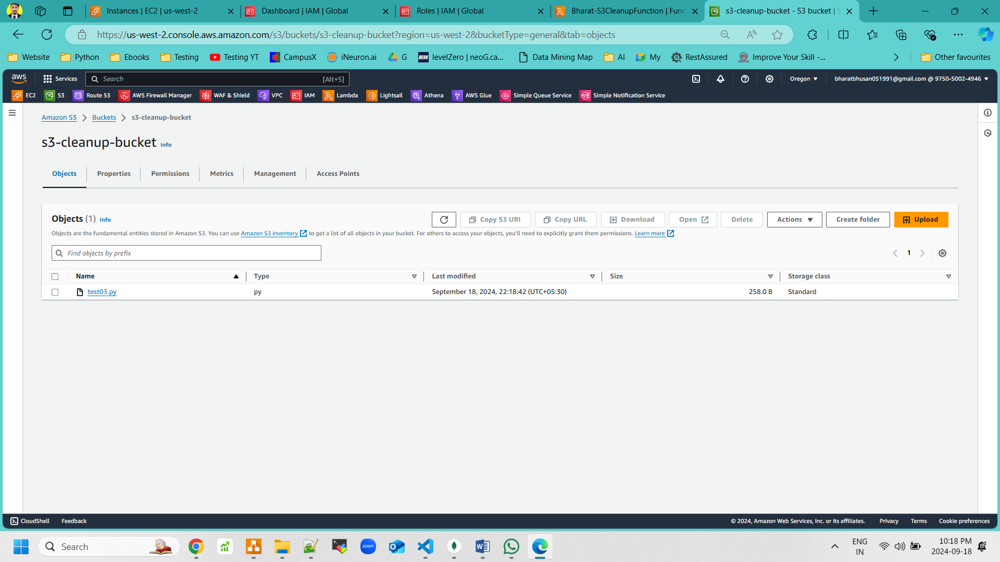
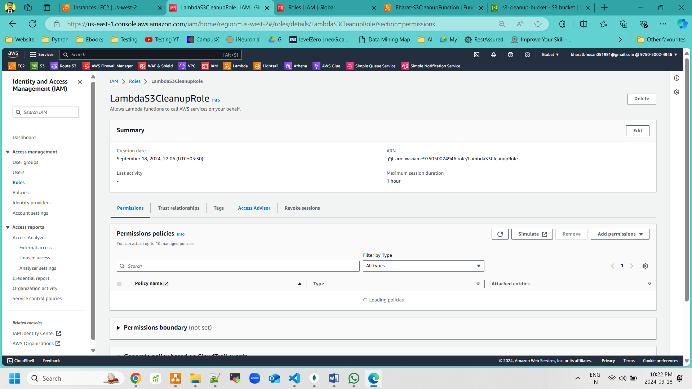
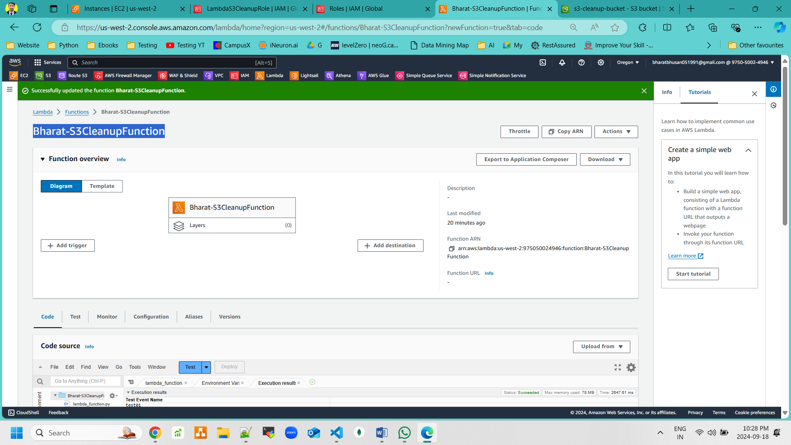
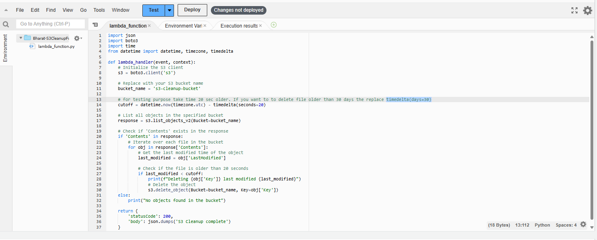
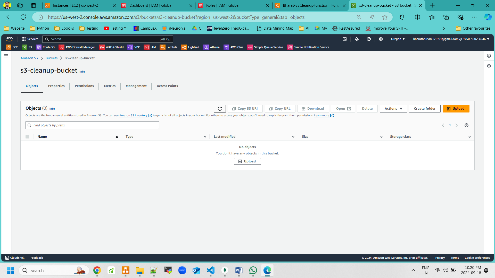

## Assignment 2: Automated S3 Bucket Cleanup Using AWS Lambda and Boto3.
- **Objective:**
      To gain experience with AWS Lambda and Boto3 by creating a Lambda function that will automatically clean up old files in an S3 bucket.
- **Task:**
     Task: Automate the deletion of files older than 30 days in a specific S3 bucket.

### 1. **S3 Setup**
   - **Create an S3 bucket:**
     1. Go to the AWS S3 dashboard.
     2. Click **Create bucket**, name it (e.g., `s3-cleanup-bucket`), and choose a region.
     3. Leave the default settings unless you have specific needs.
     4. Click **Create bucket**.

   - **Upload files:**
     1. Open the bucket you created.
     2. Click **Upload** and add files.
     3. You can use old files or temporarily adjust your system date to make files appear older than 30 days (although not recommended for production environments).
   


### 2. **Lambda IAM Role**
   - **Create a new role for Lambda:**
     1. Navigate to the **IAM dashboard**.
     2. Click on **Roles**, then **Create role**.
     3. Under **Use case**, select **Lambda**, and click **Next**.
     4. Attach the policy **AmazonS3FullAccess** (for this assignment; restrict this in real-world scenarios).
     5. Name the role (e.g., `LambdaS3CleanupRole`) and click **Create role**.
     


### 3. **Lambda Function**
   - **Create the Lambda function:**
     1. Go to the **AWS Lambda** dashboard.
     2. Click **Create function**, choose **Author from scratch**, and name the function (e.g., `S3CleanupFunction`).
     3. Select **Python 3.x** as the runtime.
     4. Under **Permissions**, choose **Use an existing role** and select the role created earlier (`LambdaS3CleanupRole`).



   - **Write the Lambda function code:**
     Use the following code to clean up files older than 30 days:

```python
import json
import boto3
import time
from datetime import datetime, timezone, timedelta

def lambda_handler(event, context):
    # Initialize the S3 client
    s3 = boto3.client('s3')
    
    # Replace with your S3 bucket name
    bucket_name = 's3-cleanup-bucket'
    
    # Calculate the cutoff date (30 days ago)
    cutoff = datetime.now(timezone.utc) - timedelta(days=30)
    
    # List all objects in the specified bucket
    response = s3.list_objects_v2(Bucket=bucket_name)
    
    # Check if 'Contents' exists in the response
    if 'Contents' in response:
        # Iterate over each file in the bucket
        for obj in response['Contents']:
            # Get the last modified time of the object
            last_modified = obj['LastModified']
            
            # Check if the file is older than 30 days
            if last_modified < cutoff:
                print(f"Deleting {obj['Key']} last modified {last_modified}")
                # Delete the object
                s3.delete_object(Bucket=bucket_name, Key=obj['Key'])
    else:
        print("No objects found in the bucket")
    
    return {
        'statusCode': 200,
        'body': json.dumps('S3 Cleanup complete')
    }
```


### 4. **Manual Invocation**
   - After saving the function, **test the function manually**:
     1. In the Lambda function console, click **Test**, then create a new test event with any name.
     2. Leave the event JSON as-is and click **Create**.
     3. Click **Test** again to invoke the function manually.
   
   - **Verify the cleanup:**
     1. Go back to the **S3 dashboard** and check the bucket.
     2. Confirm that only files **newer than 30 days** remain.
     


